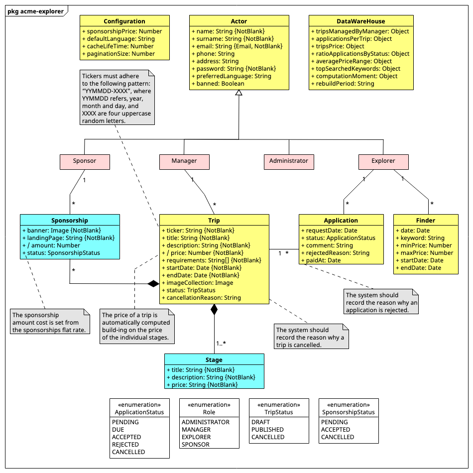

# ACME-Explorer

ACME-Explorer Backend Project

## UML Class Diagram

Problem domain models that are implemented in the developed system.

## Endpoints

BASE_ENDPOINT: `/api/v1`

### Actors

- `GET /actors`
- `POST /actors`
- `GET /actors/{id}`
- `PUT /actors/{id}`
- `DELETE /actors/{id}`
- `POST /actors/login`
- `PATCH /actors/{id}/ban`
- `PATCH /actors/{id}/update-password`

### Trips

- `GET /trips?keyword?minPrice?maxPrice?minDate?maxDate`
- `POST /trips`
- `GET /trips/{id}`
- `PUT /trips/{id}`
- `DELETE /trips/{id}`
- `GET /trips/manager/{id}`
- `PATCH /trips/{id}/publish`
- `PATCH /trips/{id}/cancel`
- `PUT /trips/{id}/sponsorships`
- `PUT /trips/{id}/sponsorships/{id}`
- `PATCH /trips/{id}/sponsorships/{id}/change-status`
- `GET /trips/sponsorships/{id}`
- `GET /trips/sponsorships/sponsor/{id}`
- `POST /trips/sponsorships/{id}/pay`

### Application

- `POST /applications`
- `GET /applications/{id}`
- `PATCH /applications/{id}/change-status`
- `PATCH /applications/{id}/change-comment`
- `PATCH /applications/{id}/reject`
- `POST /applications/{id}/pay`
- `GET /applications/explorer/{id}`
- `GET /applications/trip/{id}`

### Configuration

- `GET /configurations`
- `PUT /configurations/{id}`

### Dashboard

- `GET /dashboard`
- `POST /dashboard`
- `GET /dashboard/latest`
- `POST /api/v1/dashboard/amount-spent-by-explorer`
- `POST /api/v1/dashboard/explorers-by-amount-spent`
